<!-- readmeglow theme="aurora" layout="landing" -->
<a id="readme-top"></a>

<!-- readmeglow:begin hero
# ReadmeGlow

Drop any README.md and it becomes a stunning, designed web page.

[](https://naniiic137.github.io/readme-glow/) [](https://github.com/naniiic137/readme-glow/actions/workflows/ci.yml) [](https://github.com/naniiic137/readme-glow/actions/workflows/pages.yml)   
-->
<h1 align="center"><picture><source media="(prefers-color-scheme: dark)" srcset=".github/readmeglow/hero-dark.svg"><source media="(prefers-color-scheme: light)" srcset=".github/readmeglow/hero-light.svg"></picture></h1>
<p align="center">
  <a href="https://naniiic137.github.io/readme-glow/"></a>
  <a href="https://github.com/naniiic137/readme-glow/actions/workflows/ci.yml"></a>
  <a href="https://github.com/naniiic137/readme-glow/actions/workflows/pages.yml"></a>
  
  
  
</p>
<!-- readmeglow:end hero -->

<p align="center">Edit it on the page or in a real editor, beautify it, summarise it, export it, or carry its theme onto GitHub. Nothing leaves your browser.<br><b>Live:</b> <a href="https://naniiic137.github.io/readme-glow/">naniiic137.github.io/readme-glow</a> · <b>This README:</b> <a href="https://naniiic137.github.io/readme-glow/naniiic137/readme-glow">open it in ReadmeGlow</a></p>

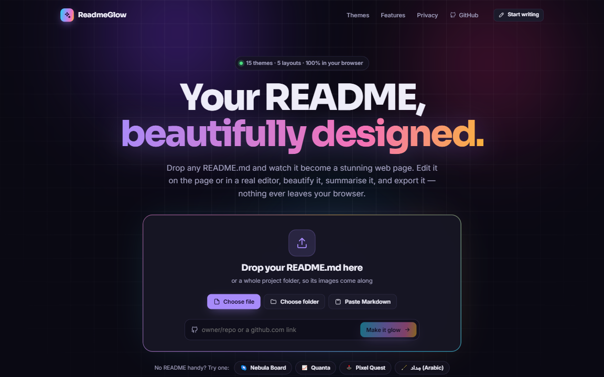

> [!TIP]
> The header, the section titles and the dividers of this README are SVG images made by ReadmeGlow's own [GitHub export](#your-theme-on-github), in the Aurora theme, for light and dark mode.

<!-- readmeglow:begin toc -->
<p align="center">
  <a href="#why"></a>
  <a href="#15-themes"></a>
  <a href="#5-layouts"></a>
  <a href="#features"></a>
  <a href="#your-theme-on-github"></a>
  <a href="#links-badge-and-bookmarklet"></a>
  <a href="#how-it-works"></a>
  <a href="#privacy-and-security"></a>
  <a href="#keyboard-shortcuts"></a>
  <a href="#tech-stack"></a>
  <a href="#run-it-locally"></a>
  <a href="#tests"></a>
</p>
<!-- readmeglow:end toc -->

<!-- readmeglow:begin h2
## Why
-->
## <a id="why"></a><picture><source media="(prefers-color-scheme: dark)" srcset=".github/readmeglow/section-01-why-dark.svg"><source media="(prefers-color-scheme: light)" srcset=".github/readmeglow/section-01-why-light.svg"></picture>
<!-- readmeglow:end h2 -->

Every README on GitHub looks the same: the same white page, the same grey code blocks. A README is often the first thing people see of a project, and it deserves better.

ReadmeGlow turns any README into a page that feels designed: pick one of 15 hand-crafted themes and 5 layouts, fix it up with one click, edit it right on the page, and share or export the result. It is a single-page app with no server; your files never leave your browser.

<!-- readmeglow:begin h2
## 15 themes
-->
## <a id="15-themes"></a><picture><source media="(prefers-color-scheme: dark)" srcset=".github/readmeglow/section-02-15-themes-dark.svg"><source media="(prefers-color-scheme: light)" srcset=".github/readmeglow/section-02-15-themes-light.svg"></picture>
<!-- readmeglow:end h2 -->

Each theme has its own fonts, palette, headings, links, callouts, tables, code blocks, image frames, list markers, rules and background. Every one is checked by tests for WCAG AA contrast (4.5:1 for body text, links, callouts and code).

| | | |
|:---:|:---:|:---:|
| 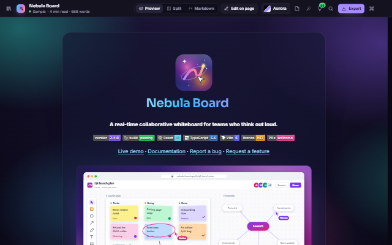<br>**Aurora**: northern lights and frosted glass | 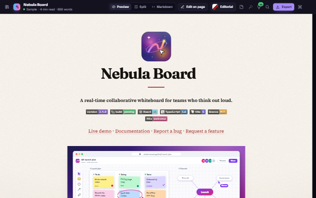<br>**Editorial**: a luxury long-read | 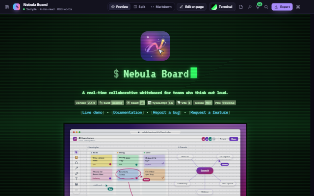<br>**Terminal**: phosphor green on a humming CRT |
| 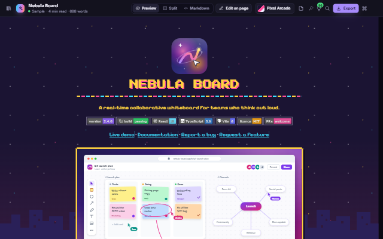<br>**Pixel Arcade**: insert coin | 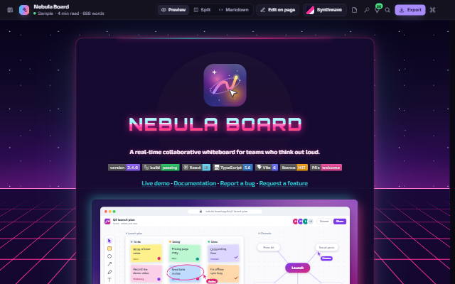<br>**Synthwave**: neon nights on an endless grid | 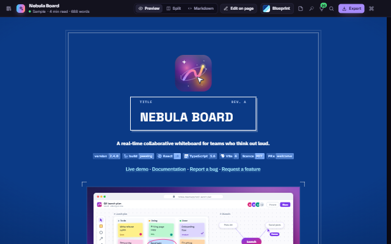<br>**Blueprint**: a technical drawing |
| 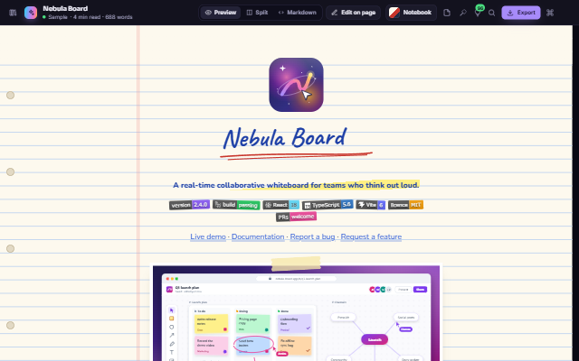<br>**Notebook**: lined paper and highlighter | 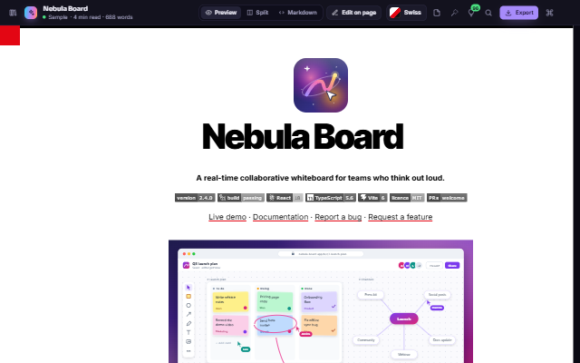<br>**Swiss**: the International Typographic Style | 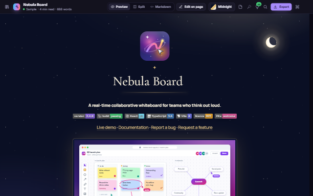<br>**Midnight**: gold on a starry night |
| 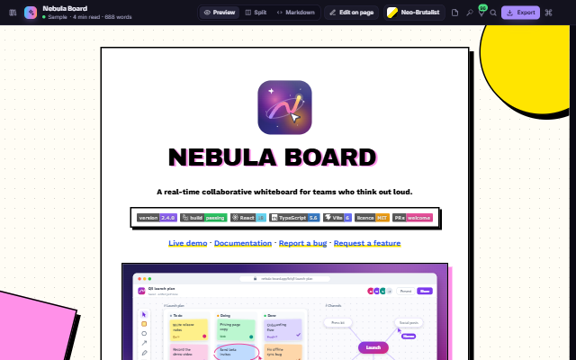<br>**Neo-Brutalist**: loud and proud | 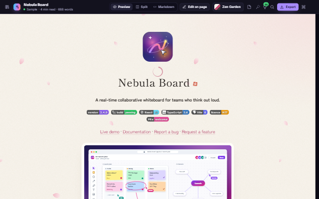<br>**Zen Garden**: calm, soft and airy | 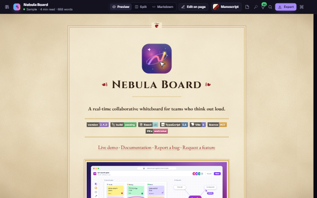<br>**Manuscript**: an illuminated page |
| 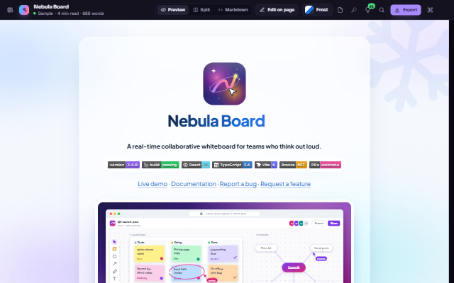<br>**Frost**: light glass | 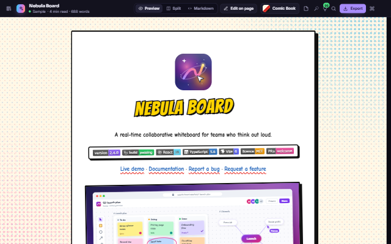<br>**Comic Book**: POW! | 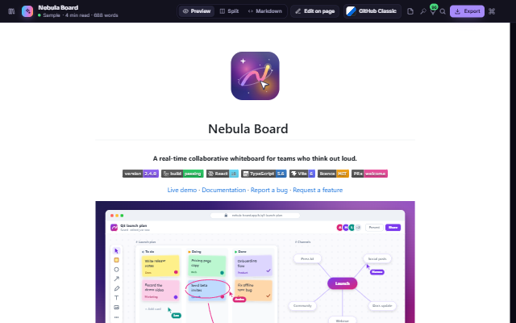<br>**GitHub Classic**: the familiar look, done right |

Themes that make sense in both have light and dark variants (GitHub, Aurora, Editorial, Pixel Arcade as a Game Boy, Blueprint as a whiteprint, Notebook as a chalkboard, Swiss, Neo-Brutalist, Zen, Frost). With *prefers-reduced-motion*, every animation stops and the page still looks finished.

<!-- readmeglow:begin h2
## 5 layouts
-->
## <a id="5-layouts"></a><picture><source media="(prefers-color-scheme: dark)" srcset=".github/readmeglow/section-03-5-layouts-dark.svg"><source media="(prefers-color-scheme: light)" srcset=".github/readmeglow/section-03-5-layouts-light.svg"></picture>
<!-- readmeglow:end h2 -->

| Layout | What it does |
|---|---|
| **Document** | A classic, beautifully set article. |
| **Docs** | A sticky contents sidebar with scroll-spy; a floating “Contents” drawer on phones. |
| **Landing** | Your title, tagline and badges become a hero; sections become cards, short lists become a card grid. |
| **Slides** | One slide per section (H2 or `---`), keyboard and swipe navigation, progress bar, full screen. |
| **Magazine** | Big editorial title and deck, two columns on wide screens, drop caps. |

| Landing (Aurora) | Docs (Editorial) |
|---|---|
| 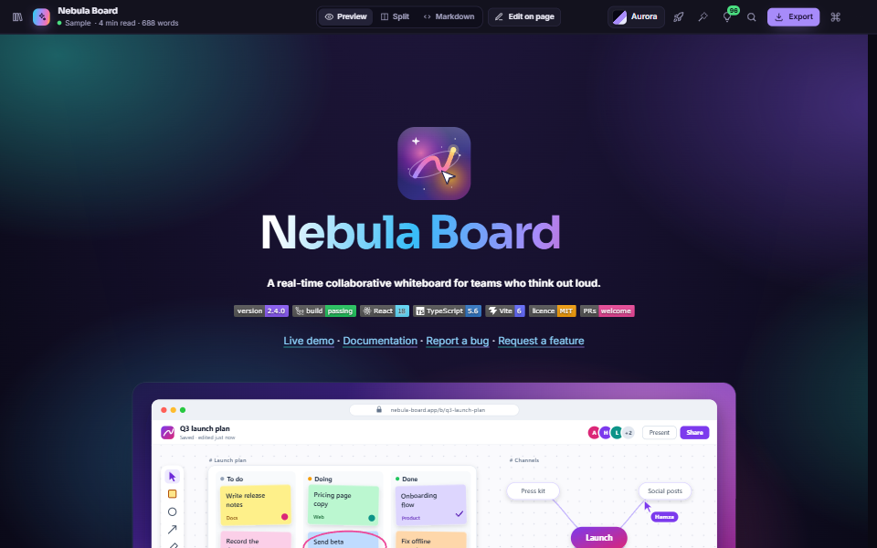 | 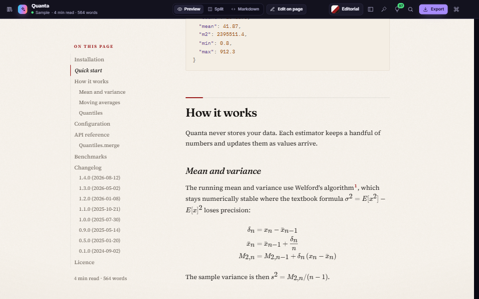 |
| **Slides (Synthwave)** | **Magazine (Swiss)** |
| 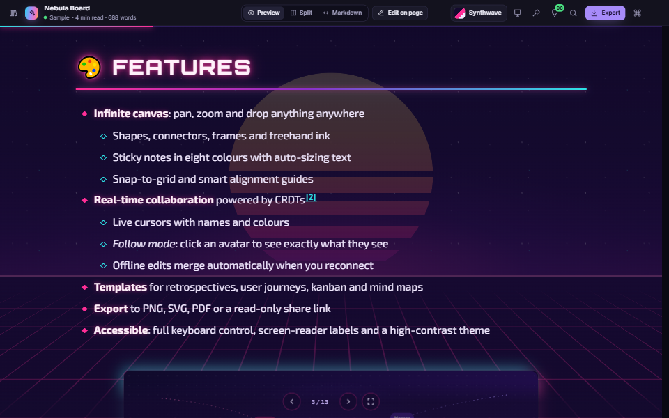 | 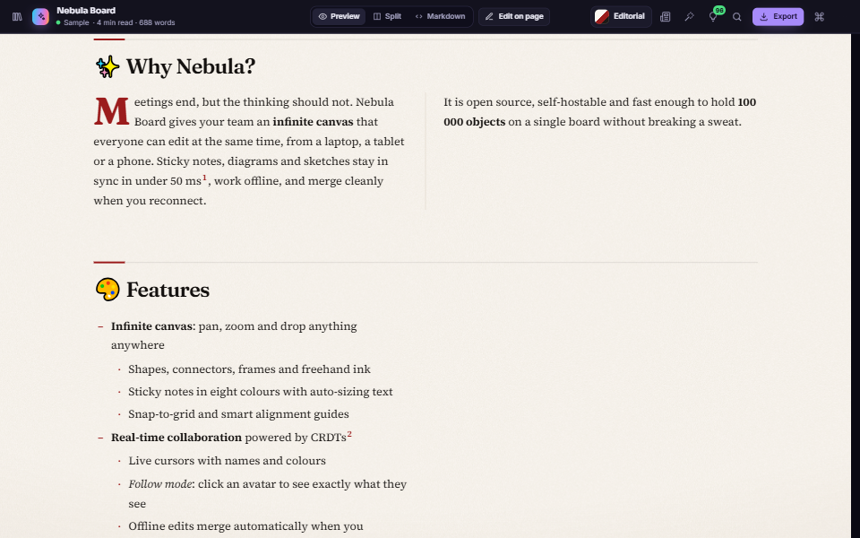 |

<!-- readmeglow:begin h2
## Features
-->
## <a id="features"></a><picture><source media="(prefers-color-scheme: dark)" srcset=".github/readmeglow/section-04-features-dark.svg"><source media="(prefers-color-scheme: light)" srcset=".github/readmeglow/section-04-features-light.svg"></picture>
<!-- readmeglow:end h2 -->

### Bring your README
- **Drop** a `.md`, `.markdown` or `.txt` file anywhere, or click the drop zone to pick one.
- **Drop a whole project folder** (or a README with its images): relative image paths just work, served from local object URLs.
- **Paste** Markdown anywhere on the start page, or in the paste box.
- **Load from GitHub**: `owner/repo`, any github.com link (`/tree/…`, `/blob/…`), `git@github.com:…` or a raw URL. Relative images point to raw.githubusercontent.com and links to github.com. Missing repositories and the API rate limit get friendly messages.
- **Samples** that use every feature: Nebula Board (web app), Quanta (library with maths), Pixel Quest (game, with an Arabic section) and a fully Arabic README.
- **Pretty links**: `naniiic137.github.io/readme-glow/owner/repo` (or `…/readme-glow/github.com/owner/repo`) opens any public repository's README. `?repo=owner/repo&theme=aurora&layout=docs` still works, and `#md=…` links carry a small README inside the URL.

### Edit it, both ways
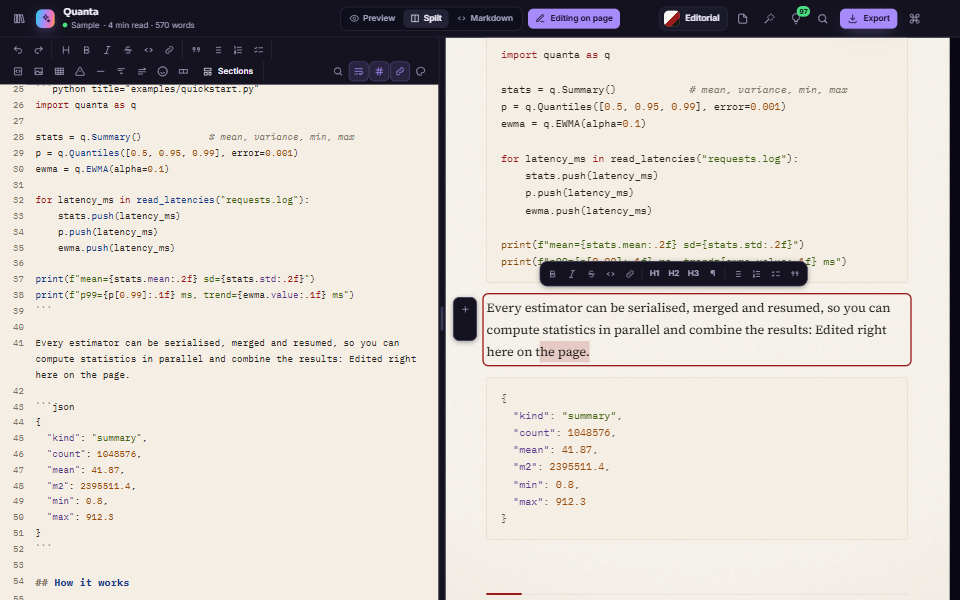

- **A real Markdown editor** (CodeMirror 6, loaded only when you open it): syntax highlighting for Markdown and the code inside it, line numbers, soft wrap, find and replace, multiple cursors, bracket and emphasis auto-pairs, list continuation and Tab indentation.
- **Formatting toolbar and shortcuts**: bold, italic, strikethrough, headings 1–6, quotes, bullet/numbered/task lists, links, images, inline code, code blocks with a language picker, tables, rules, GitHub alerts, `<details>`, footnotes and emoji.
- **Builders**: a table builder (pick a size, fill in the cells, choose alignment), a shields.io badge builder with presets and repository badges, 16 ready-made sections (Installation, Usage, FAQ, Licence…) and 6 starter templates (web app, library, CLI, game, GitHub profile, minimal).
- **Images**: paste or drop an image into the editor; it is saved with the document and inserted as `images/…`, so the .zip export includes it.
- **Edit on page**: switch it on, click any paragraph, heading, list item, table cell or code block in the themed page and type. Only the block you touched changes in the Markdown, byte for byte. Block handles add new blocks, drag or move them (Alt+↑/↓) and delete them; a floating toolbar formats selected text. Enter splits a block, Backspace at the start joins it with the one above.
- **One undo history** shared by the editor, on-page editing, Beautify, health-check fixes and inserts.
- **Two-way navigation**: click a block in the preview to jump to its source line; the editor and preview scroll together (you can turn it off).
- **Views**: preview, split (resizable), editor only, tabs on phones, and a distraction-free writing mode.
- **Your documents**: everything autosaves to your browser (IndexedDB) — several documents, rename, duplicate, delete, and your last document reopens after a reload. A dot in the top bar shows unsaved changes, and leaving the page warns you while a save is pending.

### Make it better
<table>
<tr>
<td width="50%">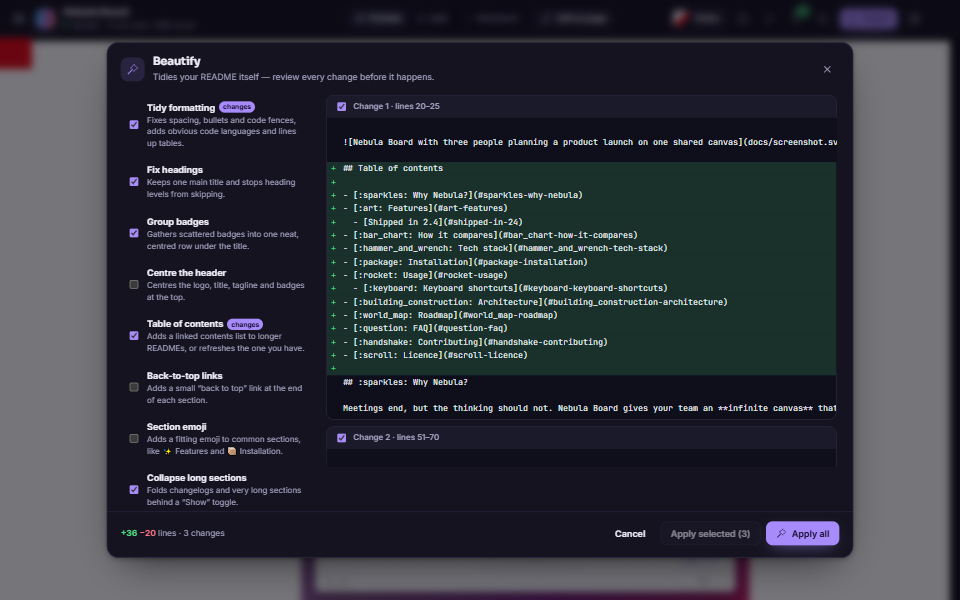</td>
<td width="50%">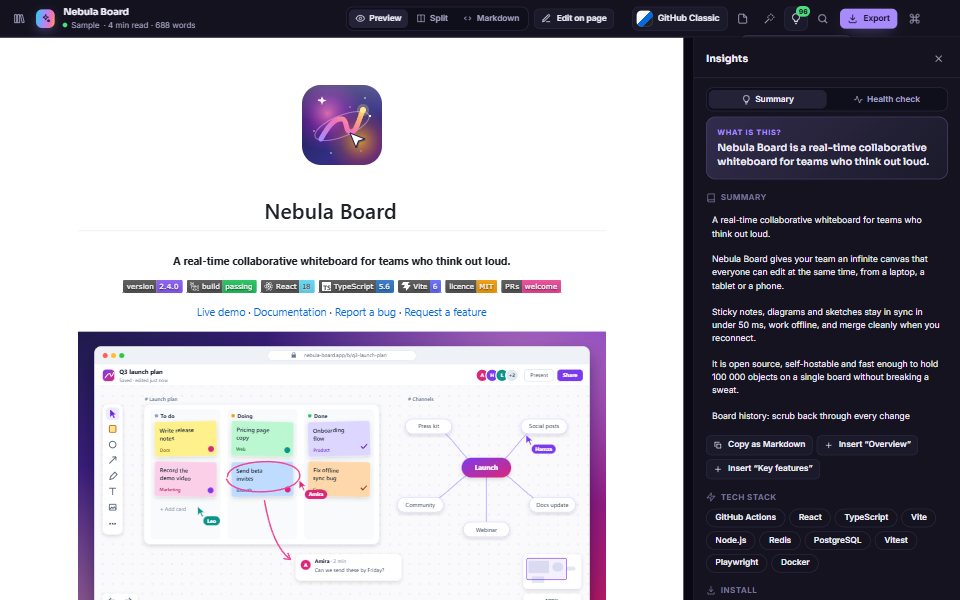</td>
</tr>
</table>

- **Beautify** tidies the README itself: consistent headings and list markers, blank lines, aligned tables, languages on code fences, one H1 and no skipped heading levels, scattered badges grouped into one centred row, an optional centred header, a table of contents with working anchors, back-to-top links, section emoji, long changelogs folded into `<details>`, and placeholders for missing essentials. You see a before/after diff and can apply everything, only the changes you tick, or nothing. Beautifying twice changes nothing the second time.
- **README health check**: a score and grade with friendly suggestions (missing title, description, installation or usage section, screenshots, licence, broken heading order, images without alt text, very long lines, empty links, broken anchors, placeholder text, code fences without a language). Many have a one-click fix, and every issue can take you to its line.
- **Summary and key insights**, offline: a one-line “what is this”, a 3–5 sentence extractive summary (TextRank), and the key facts — project name, tagline, tech stack (from badges, code languages, dependency files and a dictionary of ~150 technologies), install and run commands, requirements, links (demo, docs, website, package), licence, authors — each one clickable to scroll to where it came from. Copy it as Markdown, or insert an “Overview” or “Key features” section.
- **Optional AI summary** (off by default, bring your own key): Google Gemini, any OpenAI-compatible service (OpenAI, OpenRouter, Groq, Mistral, DeepSeek, Together) or a local Ollama. Keys stay in this tab unless you tick “remember on this device”, requests only happen when you press the button, can be cancelled, time out after 45 s, and the answer is validated before it is shown. If anything fails, the offline summary is still there.

### Make it yours
Theme gallery with live thumbnails of *your* README, light/dark variant, accent colour, font size, content width, heading style (theme, plain, underlined, accent bar, numbered, small caps), code theme (match the page, GitHub light/dark, Dracula, Nord, One Dark, Solarized, Monokai, Night Owl), code line numbers, background effect (theme, none, grain, glow, particles), scroll-reveal animations and text direction (automatic per block, so Arabic paragraphs are right-to-left). Settings are remembered and travel in share links.

### Take it anywhere
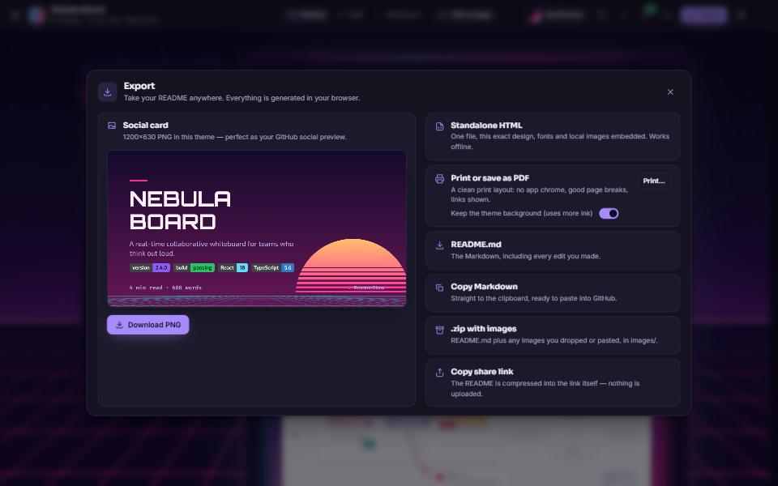

- **Standalone HTML**: one file with this exact design; the theme’s CSS is inlined, its fonts are embedded (latin subset, woff2, base64) and local images become data URIs, so it works offline. Documents with maths link KaTeX’s stylesheet from jsDelivr, because its twenty font files would triple the size.
- **Print / PDF** with a real print stylesheet: no app chrome, sensible page breaks, link addresses shown, slides one per page. Dark themes print on white by default; tick “keep the theme background” to print exactly what you see.
- **Social card**: a 1200×630 PNG drawn in the theme’s colours and fonts (title, description, badges), ideal as your GitHub social preview.
- **README.md**, **copy Markdown**, and a **.zip** with `README.md` plus your images in `images/` (paths rewritten). Each carries an invisible `<!-- readmeglow theme="…" layout="…" -->` comment, so the README reopens in the look you chose.
- **GitHub export**: your theme on github.com itself (see [below](#your-theme-on-github)).
- **Share link**: small READMEs are compressed into the link itself (lz-string); for long ones ReadmeGlow explains why and suggests sharing the GitHub link instead.

### Built for everyone
- **Keyboard everywhere**: a command palette (<kbd>Ctrl</kbd>/<kbd>⌘</kbd>+<kbd>K</kbd>) for every action, theme, layout and heading, a shortcuts overlay (<kbd>?</kbd>), find in the document with highlighting, focus management in every dialog.
- **Accessible**: landmarks, labelled controls, visible focus, live announcements, reduced motion respected, contrast tested.
- **Right-to-left**: `dir="auto"` on every block, logical CSS everywhere, Arabic fonts (Noto Sans / Naskh Arabic) for every theme, and alert titles in Arabic.
- **Responsive** from a 390 px phone to a 4K screen.

<p align="center">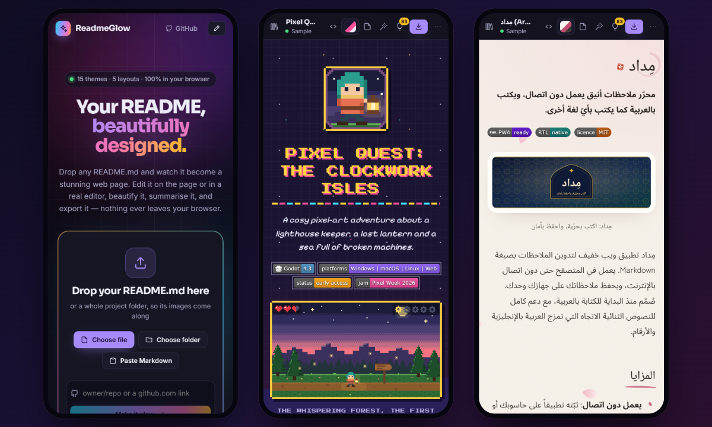</p>

<!-- readmeglow:begin h2
## Your theme on GitHub
-->
## <a id="your-theme-on-github"></a><picture><source media="(prefers-color-scheme: dark)" srcset=".github/readmeglow/section-05-your-theme-on-github-dark.svg"><source media="(prefers-color-scheme: light)" srcset=".github/readmeglow/section-05-your-theme-on-github-light.svg"></picture>
<!-- readmeglow:end h2 -->

GitHub shows a README with its own stylesheet: no custom CSS, no fonts, no scripts. The **GitHub export** (Export → GitHub export) carries the theme over using only what GitHub allows, and this README is the proof.

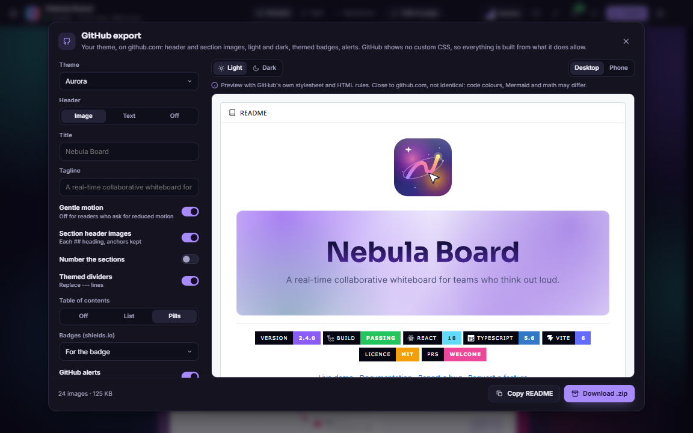

- **Header image**: the title and tagline drawn as an SVG in the theme's fonts (the letters are turned into outlines, because web fonts never load inside a README image), on the theme's background art: Aurora's glow, Synthwave's sun and grid, Blueprint's grid and dimension line, Notebook's ruled paper… An optional, gentle animation stops for readers who ask for reduced motion.
- **Section titles** for every `##` heading, and **dividers** instead of `---` lines. Each has a light and a dark version, switched with `<picture>` and `prefers-color-scheme`. Anchors keep working: links like `#installation` still land on the right section.
- **Badges** restyled in the theme's colours (shields.io style and label colour; a green “passing” keeps its meaning), `> **Note**` quotes turned into real GitHub alerts, an optional table of contents (a list, or pills in the theme's colours) and long changelogs folded into `<details>`.
- **Safe images**: plain SVG shapes and gradients only. No external requests, no fonts, no scripts; a header is about 20 KB and a section title 2 to 8 KB.
- **A GitHub preview** before you download: the same HTML allow-list as github.com and GitHub's own stylesheet, in light and dark, desktop and phone width. It is close to github.com, not identical (code colours, Mermaid and maths can differ).
- **Download .zip** gives you `README.md` and the `.github/readmeglow/` folder: unzip it at the root of your repository and commit both. **Copy README** copies only the text, so you still need the images from the zip.
- **Reversible**: everything the export changes sits between invisible markers that keep your original Markdown. Opening the exported README in ReadmeGlow shows the Markdown behind the images, and exporting again never stacks a second header.

Text in scripts the theme font does not cover (Arabic, Chinese, emoji…) is written with the reader's system font instead of outlines, so it always reads correctly.

<!-- readmeglow:begin h2
## Links, badge and bookmarklet
-->
## <a id="links-badge-and-bookmarklet"></a><picture><source media="(prefers-color-scheme: dark)" srcset=".github/readmeglow/section-06-links-badge-and-bookmarklet-dark.svg"><source media="(prefers-color-scheme: light)" srcset=".github/readmeglow/section-06-links-badge-and-bookmarklet-light.svg"></picture>
<!-- readmeglow:end h2 -->

Everything is in **⋯ → Share & access**.

- **Pretty links**: put the ReadmeGlow address in front of any repository, `https://naniiic137.github.io/readme-glow/owner/repo`, or in front of a GitHub link, `…/readme-glow/github.com/owner/repo`. `/tree/branch/folder` and `/blob/branch/file.md` work too. (GitHub Pages answers unknown paths with the app's `404.html`, which is the app itself.)
- **Your repository's Website link**: on GitHub, click the gear next to **About**, paste the pretty link into **Website**, and press **Save changes**. The link under the description then opens the README in ReadmeGlow. This repository's Website is the app itself: https://naniiic137.github.io/readme-glow/.
- **A redirect page**: download a tiny `index.html` for your own repository, publish it with GitHub Pages (`docs/` folder), and `owner.github.io/repo/` opens the README in ReadmeGlow. It uses a meta refresh, a script that keeps the `#section`, and a plain link as a fallback.
- **A bookmarklet**: drag it to your bookmarks bar and click it on any github.com repository page. It refuses to run anywhere else.
- **The “View with ReadmeGlow” badge**:

```markdown
[](https://naniiic137.github.io/readme-glow/?repo=owner/repo&theme=aurora&layout=landing)
```

[](https://naniiic137.github.io/readme-glow/?repo=naniiic137/readme-glow&theme=aurora&layout=landing)

A browser extension that adds a button to GitHub itself is a possible future addition; ReadmeGlow does not ship one today.

<!-- readmeglow:begin h2
## How it works
-->
## <a id="how-it-works"></a><picture><source media="(prefers-color-scheme: dark)" srcset=".github/readmeglow/section-07-how-it-works-dark.svg"><source media="(prefers-color-scheme: light)" srcset=".github/readmeglow/section-07-how-it-works-light.svg"></picture>
<!-- readmeglow:end h2 -->

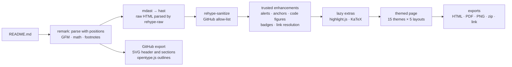
```mermaid
flowchart LR
  A[README.md] --> B[remark: parse with positions<br/>GFM · math · footnotes]
  B --> C[mdast → hast<br/>raw HTML parsed by rehype-raw]
  C --> D[rehype-sanitize<br/>GitHub allow-list]
  D --> E[trusted enhancements<br/>alerts · anchors · code figures<br/>badges · link resolution]
  E --> F[lazy extras<br/>highlight.js · KaTeX]
  F --> G[themed page<br/>15 themes × 5 layouts]
  G --> H[exports<br/>HTML · PDF · PNG · zip · link]
  B --> I[GitHub export<br/>SVG header and sections<br/>opentype.js outlines]
```

1. **Parse once, keep positions.** The Markdown is parsed with remark (GFM, footnotes, maths) in a Web Worker. Every rendered block remembers the exact source range it came from; that is what makes on-page editing, click-to-source and scroll sync possible.
2. **Sanitise before anything else.** Raw HTML is parsed into the tree and cleaned with rehype-sanitize (GitHub’s own allow-list, minus a few things). Only then do trusted steps add alerts, heading anchors, code headers with copy buttons, badge rows, lightbox hooks and repository-relative URLs.
3. **Load heavy extras on demand.** Syntax highlighting, KaTeX, Mermaid, the emoji table, the code editor and each theme’s fonts are separate chunks, loaded only when a document or a theme needs them.
4. **Edit the source, never re-serialise it.** Every edit — typed, on the page, from Beautify or a fix — becomes a splice into the Markdown with one shared undo history, so untouched text stays byte-identical.

<!-- readmeglow:begin h2
## Privacy and security
-->
## <a id="privacy-and-security"></a><picture><source media="(prefers-color-scheme: dark)" srcset=".github/readmeglow/section-08-privacy-and-security-dark.svg"><source media="(prefers-color-scheme: light)" srcset=".github/readmeglow/section-08-privacy-and-security-light.svg"></picture>
<!-- readmeglow:end h2 -->

- **No server, no uploads.** Files are read and rendered in your browser and saved in its own storage (IndexedDB). The only network requests are the ones you ask for: a public README from the GitHub API, the images your README links to, and — only if you enable it with your own key — an AI summary.
- **XSS-proof rendering.** All README HTML goes through rehype-sanitize; scripts, event handlers, `javascript:`/`vbscript:`/`data:` links, frames, objects, SVG, forms and style attributes are removed, and ids are prefixed so they cannot clobber globals. 37 classic attack vectors are covered by tests. Mermaid runs with `securityLevel: 'strict'` and its SVG is sanitised again with DOMPurify.
- **Strict Content-Security-Policy** in the built page: scripts only from the site itself (no inline scripts, no `eval`), images from `https:`/`data:`/`blob:`, network access only to the GitHub API, raw.githubusercontent.com and the optional AI providers. Inline styles are allowed because KaTeX and Mermaid output needs them; user-supplied styles are stripped by the sanitiser.

<!-- readmeglow:begin h2
## Keyboard shortcuts
-->
## <a id="keyboard-shortcuts"></a><picture><source media="(prefers-color-scheme: dark)" srcset=".github/readmeglow/section-09-keyboard-shortcuts-dark.svg"><source media="(prefers-color-scheme: light)" srcset=".github/readmeglow/section-09-keyboard-shortcuts-light.svg"></picture>
<!-- readmeglow:end h2 -->

| Shortcut | Action |
|---|---|
| <kbd>Ctrl</kbd>/<kbd>⌘</kbd> <kbd>K</kbd> | Command palette |
| <kbd>?</kbd> | All shortcuts |
| <kbd>Ctrl</kbd> <kbd>F</kbd> or <kbd>/</kbd> | Find in the document |
| <kbd>Alt</kbd> <kbd>1</kbd> / <kbd>2</kbd> / <kbd>3</kbd> | Preview / split / editor |
| <kbd>Alt</kbd> <kbd>E</kbd> | Edit on page |
| <kbd>Alt</kbd> <kbd>T</kbd> · <kbd>Alt</kbd> <kbd>L</kbd> | Next theme · next layout |
| <kbd>Alt</kbd> <kbd>Z</kbd> | Distraction-free writing |
| <kbd>Ctrl</kbd> <kbd>Z</kbd> / <kbd>Ctrl</kbd> <kbd>Shift</kbd> <kbd>Z</kbd> | Undo / redo (shared by both editors) |
| <kbd>Ctrl</kbd> <kbd>Shift</kbd> <kbd>E</kbd> | Export |
| <kbd>Ctrl</kbd> <kbd>B</kbd> · <kbd>I</kbd> · <kbd>E</kbd> | Bold · italic · inline code |
| <kbd>Ctrl</kbd> <kbd>Alt</kbd> <kbd>1</kbd>–<kbd>6</kbd> | Heading 1–6 |
| <kbd>Ctrl</kbd> <kbd>Shift</kbd> <kbd>L</kbd> | Link |
| <kbd>Ctrl</kbd> <kbd>Shift</kbd> <kbd>8</kbd> / <kbd>7</kbd> / <kbd>9</kbd> | Bullet / numbered / task list |
| <kbd>→</kbd> <kbd>←</kbd> <kbd>F</kbd> | Slides: next, previous, full screen |

<!-- readmeglow:begin h2
## Tech stack
-->
## <a id="tech-stack"></a><picture><source media="(prefers-color-scheme: dark)" srcset=".github/readmeglow/section-10-tech-stack-dark.svg"><source media="(prefers-color-scheme: light)" srcset=".github/readmeglow/section-10-tech-stack-light.svg"></picture>
<!-- readmeglow:end h2 -->

- **React 18**, **TypeScript** (strict) and **Vite**, deployed to GitHub Pages by GitHub Actions.
- **unified / remark / rehype**: remark-gfm, remark-math, rehype-raw, **rehype-sanitize**, rehype-katex, lowlight (highlight.js grammars), github-slugger, gemoji.
- **CodeMirror 6** for the editor, **Mermaid** + **DOMPurify** for diagrams, **KaTeX** for maths.
- **@fontsource** for 32 self-hosted font families (loaded only when a theme uses them), **opentype.js** to turn them into SVG outlines for the GitHub export, **github-markdown-css** for the GitHub preview, **lz-string** for share links, **fflate** for zip files, **zod** to validate AI answers.
- **Vitest**, Testing Library, jsdom and fake-indexeddb for tests.

<!-- readmeglow:begin h2
## Run it locally
-->
## <a id="run-it-locally"></a><picture><source media="(prefers-color-scheme: dark)" srcset=".github/readmeglow/section-11-run-it-locally-dark.svg"><source media="(prefers-color-scheme: light)" srcset=".github/readmeglow/section-11-run-it-locally-light.svg"></picture>
<!-- readmeglow:end h2 -->

```bash
git clone https://github.com/naniiic137/readme-glow.git
cd readme-glow
npm ci
npm run dev        # http://localhost:3751/readme-glow/
npm test           # the whole test suite
npm run build      # typecheck + production build in dist/
```

<!-- readmeglow:begin h2
## Tests
-->
## <a id="tests"></a><picture><source media="(prefers-color-scheme: dark)" srcset=".github/readmeglow/section-12-tests-dark.svg"><source media="(prefers-color-scheme: light)" srcset=".github/readmeglow/section-12-tests-light.svg"></picture>
<!-- readmeglow:end h2 -->

1,379 tests in 48 files (Vitest), run on every push by CI. They cover:

- **Markdown pipeline**: GFM, alerts, footnotes, headings and GitHub-compatible slugs, code blocks, maths, badges, source mapping.
- **Sanitisation**: 37 XSS vectors (script tags, `onerror`, `javascript:` URLs, SVG `onload`, iframes, style injection, mXSS, DOM clobbering…).
- **GitHub**: every URL form, relative link and image resolution, rate-limit and 404 handling.
- **Editing**: formatting commands, table and badge builders, templates, zip path rewriting, the shared undo history, autosave and restore, the visual editor’s block operations — including a fuzz test over the sample READMEs proving that editing one block leaves every other byte untouched.
- **Beautify** (idempotence over randomised READMEs), **health check** rules and fixes, **summary and facts** extractors, the **AI client** (with a fake fetch), **share links**, **settings persistence**, and the **theme registry** (every theme defines every token and passes the contrast rules).
- **GitHub export**: every theme's header, section and divider SVGs are valid XML with no external references, stay small and are deterministic; animations live only inside a reduced-motion media query; text outlines, emoji and missing-script fallbacks; the Markdown transform (anchors, badges, alerts, table of contents, folding, CRLF) round-trips back to the original and exporting twice changes nothing; the GitHub preview sanitiser; zip paths; the config comment.
- **Links**: pretty paths (owner/repo, github.com/…, /tree/, /blob/), the redirect page (escaping) and the bookmarklet, which is run against real and hostile page addresses.
- **Components**: drop zone and file input, command palette, dialogs and focus trapping, the editor, Beautify, table builder, GitHub export and Share & access dialogs, find bar, global shortcuts, landing page and workspace.

<!-- readmeglow:begin divider b64:LS0t -->
<p align="center"><picture><source media="(prefers-color-scheme: dark)" srcset=".github/readmeglow/divider-dark.svg"><source media="(prefers-color-scheme: light)" srcset=".github/readmeglow/divider-light.svg"></picture></p>
<!-- readmeglow:end divider -->

<p align="center">© 2026 Hamza Ben Ismail. All rights reserved.</p>
<p align="center"><a href="#readme-top">Back to top ↑</a></p>
