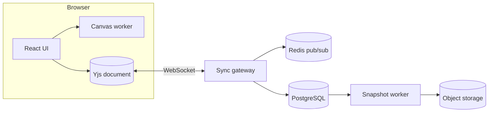

<div align="center">


# Nebula Board

**A real-time collaborative whiteboard for teams who think out loud.**

[](https://github.com/nebula-labs/nebula-board/releases)
[](https://github.com/nebula-labs/nebula-board/actions)
[](https://react.dev)
[](https://www.typescriptlang.org)
[](https://vite.dev)
[](https://github.com/nebula-labs/nebula-board/blob/main/LICENSE)
[](https://github.com/nebula-labs/nebula-board/blob/main/CONTRIBUTING.md)

[Live demo](https://nebula-board.example.com) · [Documentation](https://nebula-board.example.com/docs) · [Report a bug](https://github.com/nebula-labs/nebula-board/issues/new) · [Request a feature](https://github.com/nebula-labs/nebula-board/discussions)

</div>


## :sparkles: Why Nebula?

Meetings end, but the thinking should not. Nebula Board gives your team an **infinite canvas** that everyone can edit at the same time, from a laptop, a tablet or a phone. Sticky notes, diagrams and sketches stay in sync in under 50 ms[^latency], work offline, and merge cleanly when you reconnect.

It is open source, self-hostable and fast enough to hold **100 000 objects** on a single board without breaking a sweat.

## :art: Features

- **Infinite canvas**: pan, zoom and drop anything anywhere
  - Shapes, connectors, frames and freehand ink
  - Sticky notes in eight colours with auto-sizing text
  - Snap-to-grid and smart alignment guides
- **Real-time collaboration** powered by CRDTs[^crdt]
  - Live cursors with names and colours
  - *Follow mode*: click an avatar to see exactly what they see
  - Offline edits merge automatically when you reconnect
- **Templates** for retrospectives, user journeys, kanban and mind maps
- **Export** to PNG, SVG, PDF or a read-only share link
- **Accessible**: full keyboard control, screen-reader labels and a high-contrast theme


### Shipped in 2.4

- [x] Presentation mode with frame-by-frame navigation
- [x] Comment threads with @mentions and emoji reactions
- [x] Board history: scrub back through every change
- [ ] Audio huddles (beta, behind the `huddles` flag)

## :bar_chart: How it compares

| Capability              | Nebula Board | Typical whiteboard app | Shared slides |
| :---------------------- | :----------: | :--------------------: | :-----------: |
| Live cursors            |      ✅      |           ✅           |      ❌       |
| Works offline           |      ✅      |           ❌           |      ⚠️       |
| Infinite canvas         |      ✅      |           ✅           |      ❌       |
| Self-hostable           |      ✅      |           ❌           |      ❌       |
| Open source             |   **MIT**    |           —            |       —       |

| Metric                        |     Value |
| :---------------------------- | --------: |
| Cursor latency (p95)          |     38 ms |
| Objects per board (tested)    |   100 000 |
| Initial bundle (gzip)         |    182 kB |
| Lighthouse performance score  |        98 |

## :hammer_and_wrench: Tech stack

| Layer   | Technology                                   |
| ------- | -------------------------------------------- |
| UI      | React 18, TypeScript, Vite                   |
| Canvas  | Canvas 2D in an `OffscreenCanvas` worker     |
| Sync    | Yjs CRDT documents over WebSocket            |
| Server  | Node.js 22, Fastify, Redis pub/sub           |
| Storage | PostgreSQL 16 and S3-compatible object store |
| Tests   | Vitest and Playwright                        |

## :package: Installation

> [!IMPORTANT]
> Nebula Board needs **Node.js 20.11 or newer** and a running **Redis 7** instance for real-time sync.

```bash title="terminal"
git clone https://github.com/nebula-labs/nebula-board.git
cd nebula-board
npm install
cp .env.example .env
npm run dev
```

Open <http://localhost:5173>, create a board and share the link with a teammate.

> [!TIP]
> Run `npm run dev -- --host` to open the board on your phone over the local network.

<details>
<summary><strong>Self-hosting with Docker Compose</strong></summary>

```yaml title="docker-compose.yml"
services:
  app:
    image: ghcr.io/nebula-labs/nebula-board:2.4
    ports:
      - "8080:8080"
    environment:
      DATABASE_URL: postgres://nebula:nebula@db:5432/nebula
      REDIS_URL: redis://cache:6379
    depends_on: [db, cache]
  db:
    image: postgres:16
    environment:
      POSTGRES_USER: nebula
      POSTGRES_PASSWORD: nebula
  cache:
    image: redis:7-alpine
```

Then run `docker compose up -d` and open port 8080.

</details>

## :rocket: Usage

Embed a board in your own app with the SDK:

```ts title="src/app.ts"
import { createBoard, presence } from '@nebula/board';

const board = await createBoard({
  room: 'launch-plan',
  user: { name: 'Hamza', colour: '#8B5CF6' },
});

board.on('change', (event) => {
  console.log(`${event.author} changed ${event.ids.length} objects`);
});

board.add('sticky', { x: 120, y: 80, text: 'Ship the beta 🚀' });
presence.follow(board, 'amira');
```

> [!NOTE]
> The SDK is framework-agnostic. React bindings live in `@nebula/react`.

### :keyboard: Keyboard shortcuts

| Action          | Shortcut                                        |
| :-------------- | :---------------------------------------------- |
| Select          | <kbd>V</kbd>                                    |
| Sticky note     | <kbd>N</kbd>                                    |
| Pan             | Hold <kbd>Space</kbd> and drag                  |
| Undo            | <kbd>Ctrl</kbd> + <kbd>Z</kbd>                  |
| Redo            | <kbd>Ctrl</kbd> + <kbd>Shift</kbd> + <kbd>Z</kbd> |
| Command palette | <kbd>Ctrl</kbd> + <kbd>K</kbd>                  |

On macOS, use <kbd>⌘</kbd> wherever you see <kbd>Ctrl</kbd>.

## :building_construction: Architecture



Every board is a Yjs document. The gateway relays updates between clients through Redis, so you can run as many gateway instances as you like behind a load balancer. A snapshot worker compacts history every few minutes.

> [!WARNING]
> Boards created with 1.x use the old JSON format. Run `npm run migrate` **before** upgrading a self-hosted instance to 2.x.

## :world_map: Roadmap

- [x] Offline mode with automatic merge
- [x] Presentation mode
- [ ] Audio huddles
- [ ] Plugin API for custom shapes
- [ ] Native iPad app with Apple Pencil support

## :question: FAQ

<details>
<summary>Is Nebula Board free?</summary>

Yes. The code is MIT-licensed and the hosted version is free for teams of up to ten people.

</details>

<details>
<summary>Where is my data stored?</summary>

On the hosted version, in the EU (Frankfurt). When you self-host, it never leaves your servers.

</details>

<details>
<summary>Can I import boards from other tools?</summary>

You can import SVG, PNG and CSV files today. Importers for other formats are on the roadmap.

</details>

> [!CAUTION]
> Deleting a board is permanent: it removes every version from history. Export a copy first if you might need it again.

## :handshake: Contributing

Contributions are very welcome, from typo fixes to new shapes.

1. Fork the repository and create a branch: `git checkout -b feat/my-idea`
2. Run the tests with `npm test` and the linter with `npm run lint`
3. Open a pull request that explains **what** changed and **why**

Please read the [contributing guide](https://github.com/nebula-labs/nebula-board/blob/main/CONTRIBUTING.md) and our [code of conduct](https://github.com/nebula-labs/nebula-board/blob/main/CODE_OF_CONDUCT.md) first.

## :scroll: Licence

Released under the [MIT Licence](https://github.com/nebula-labs/nebula-board/blob/main/LICENSE). Made with :purple_heart: by the Nebula Labs team and [contributors](https://github.com/nebula-labs/nebula-board/graphs/contributors).

[^crdt]: Conflict-free replicated data types: every device can edit its own copy, and all copies converge to the same state without a central lock.
[^latency]: Median of 10 000 cursor updates between London and Tunis on a 4G connection.
